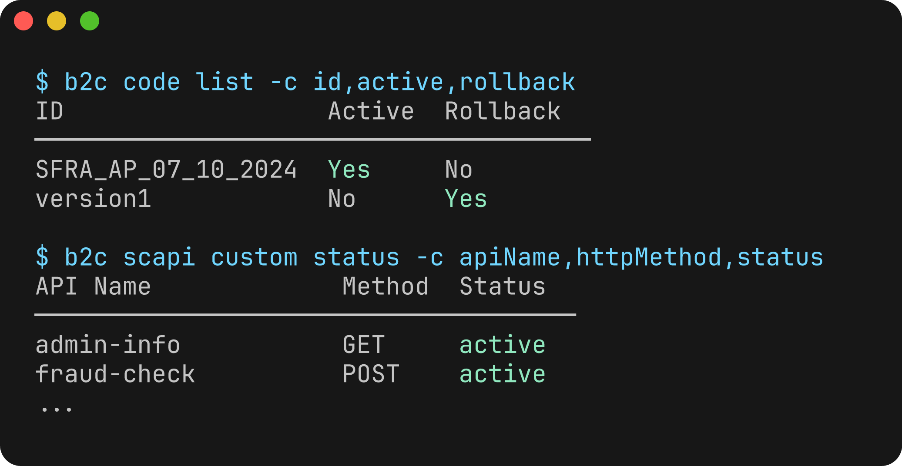

# Agentic B2C Developer Toolkit

Salesforce B2C Commerce tools for developers, administrators, and AI agents.

Build storefronts, deploy code, investigate issues, and manage your sites from your terminal, editor, or AI assistant.

<a class="primary-cta" href="./guide/">Get started</a>

<a class="secondary-cta" href="./guide/installation">Install the B2C CLI</a>

<figure class="cli-preview">

</figure>

## Tools

<DocCards>

[ CLI](./cli/overview)
Deploy cartridges, run jobs, manage sandboxes, and automate your B2C Commerce workflows.

[ IDE Extension](./vscode-extension/)
Sync code, explore your instance, and debug server-side scripts in your editor.

[ MCP / Agent Skills](./mcp/)
Connect your assistant to B2C Commerce tools, nearly 600 API operations, and workflow skills.

</DocCards>

## Developer Tasks

### Build with B2C Commerce skills

Give your assistant the development patterns for your next storefront change.

> Create a Page Designer component for my Storefront Next project with an editable heading, image, and link.

[See Agent Skills in action](./guide/agent-skills#skills-in-action) &middot; [Storefront Next guide](./guide/storefront-next)

<figure>

</figure>

<DocCards>

[Debug cartridge code](./guide/script-debugger)
Set breakpoints and inspect server-side scripts in your editor.

[Deploy code and metadata](./guide/import-sets)
Apply project configuration and metadata changes with import sets.

[CI/CD with GitHub Actions](./guide/ci-cd)
Automate builds, deployments, and other repeatable B2C Commerce tasks.

</DocCards>

## Administrator and Merchant Tasks

### Review promotions before launch

Ask your assistant to review campaign schedules and identify what needs attention.

> Summarize the promotions in campaign spring-sale. Flag schedule conflicts and disabled promotions.

[Explore administrator and merchant tasks](./mcp/#administrator-and-merchant-tasks)

<figure>

</figure>

<DocCards>

[Manage users and API clients](./guide/account-manager)
Review users, roles, organizations, and API access in Account Manager.

[Investigate job failures](./mcp/toolsets#scapi-code-mode)
Ask your assistant to review job executions and identify recurring failures.

[Explore analytics reports](./guide/analytics-reports-cip-ccac)
Query B2C Commerce data and turn operational reports into useful answers.

</DocCards>

## More Resources

<DocCards>

[All Guides](./guide/workflows)
Find practical workflows for development, deployment, administration, and migration.

[CLI Extensions](./guide/third-party-plugins)
Add integrations and commands to fit your team's workflow.

[Tooling SDK](./api/)
Build custom integrations and automation with typed TypeScript APIs.

</DocCards>
