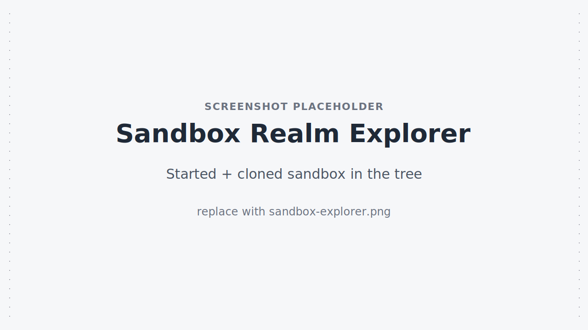
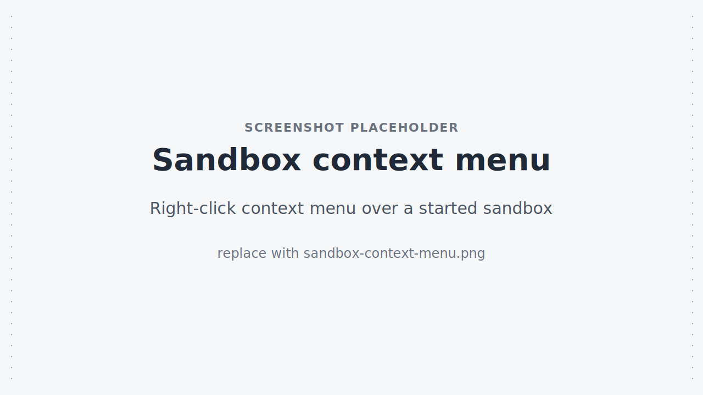
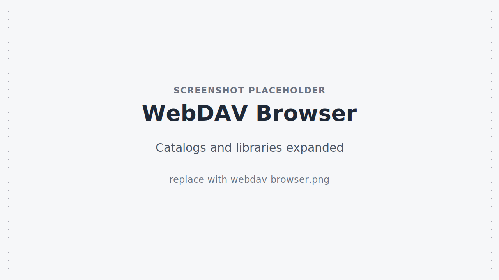
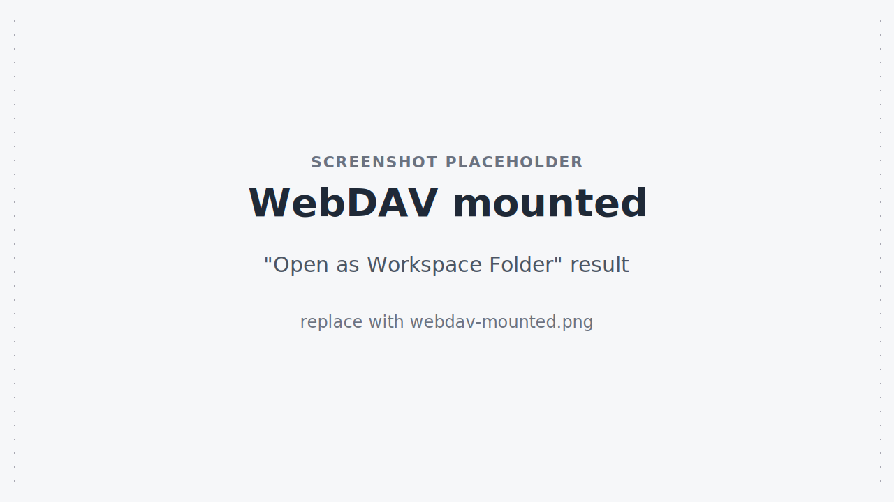
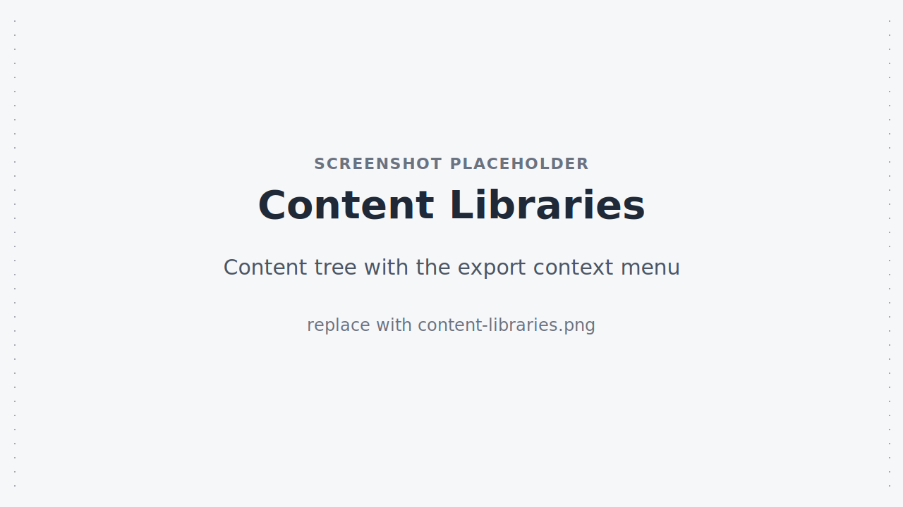
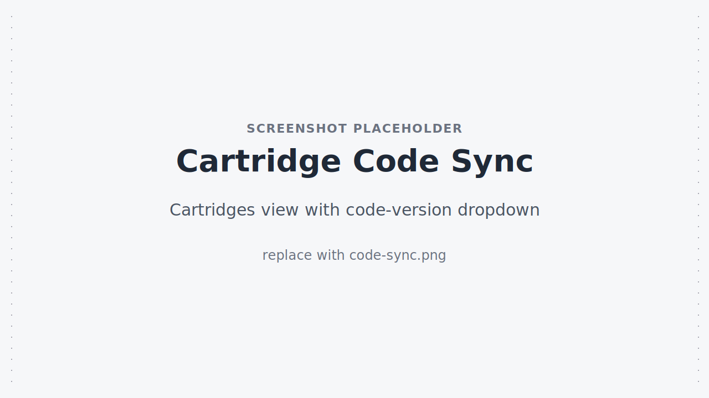
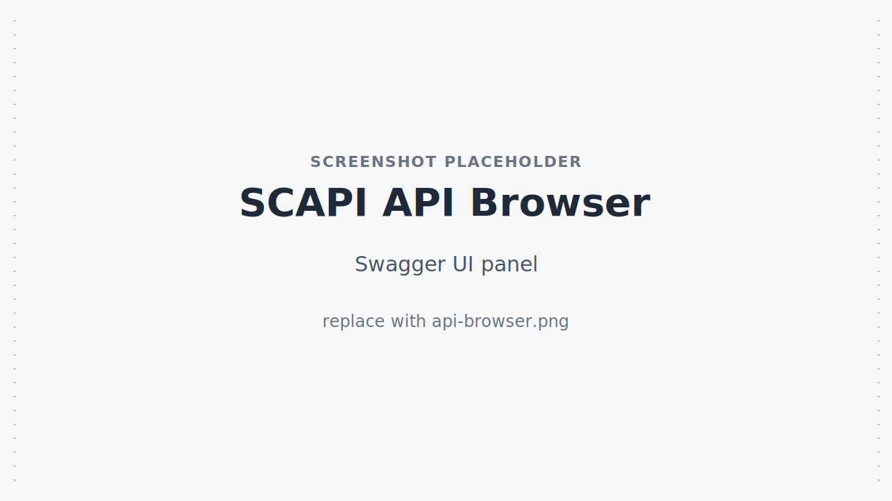
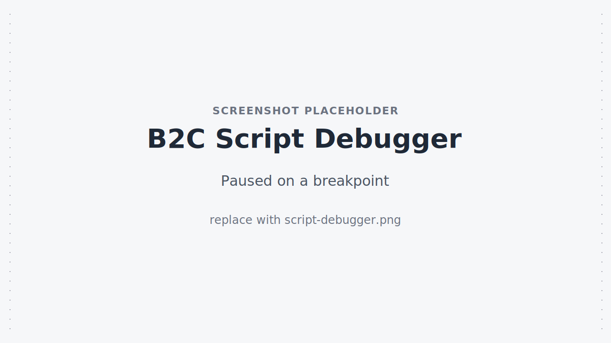
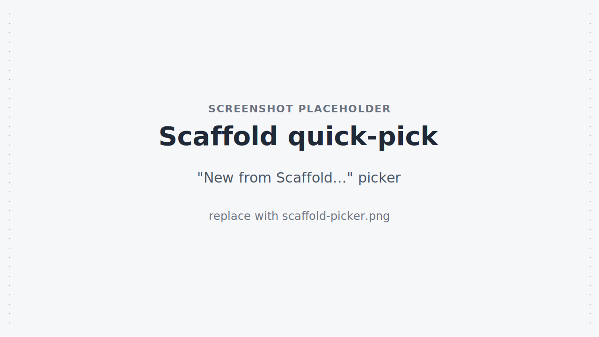
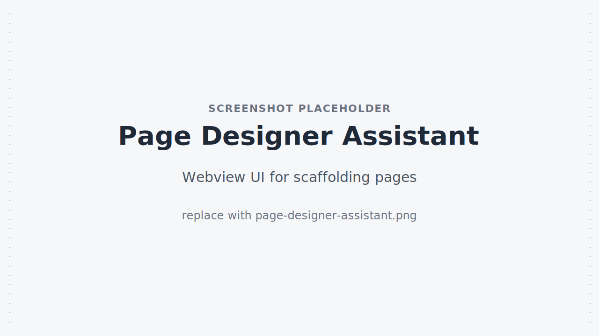

# Features

A guided tour of what the extension can do. All commands are reachable from the Command Palette under the **B2C DX** category — this page focuses on what each feature is *for* and the actions you can only reach through tree-view right-clicks.

## Sandbox Realm Explorer

Browse and manage on-demand sandboxes (ODS) for one or more realms in a dedicated activity-bar container (**B2C-DX Sandboxes**). The tree groups sandboxes by realm, and each row carries a state-derived context value (`sandbox-started`, `sandbox-stopped`, `sandbox-cloning`, `sandbox-settingup-cloned`, etc.) so the right-click menu only offers actions that make sense for the current state.

**Lifecycle commands** (palette + right-click): create, start, stop, restart, clone, view details, view clone details, extend expiration, open Business Manager, delete.

**Cloned sandbox indicators** — clones are tagged in the tree. While a clone is being set up, the source sandbox is shown as `cloning` and the new (target) sandbox is shown as `setting up`. Once the clone stabilizes, both rows display their actual states (`started`, `stopped`, etc.) and the cloned target keeps a visual marker so you can tell it apart from a freshly created sandbox.

<!-- TODO(screenshot): replace ./images/sandbox-explorer.svg with ./images/sandbox-explorer.png — started + cloned sandbox in the tree -->


<!-- TODO(screenshot): replace ./images/sandbox-context-menu.svg with ./images/sandbox-context-menu.png — right-click context menu over a started sandbox -->


Polling cadence is controlled by [`b2c-dx.sandbox.pollingInterval`](./configuration#sandbox-polling-interval).

## WebDAV Browser

A tree of WebDAV catalogs and libraries plus a registered file-system provider (`b2c-webdav://`) so you can mount a remote folder as a workspace folder.

**Tree-only actions** (right-click on a catalog, library, or directory):

- **New File / New Folder / Upload File** — create or push directly to the instance.
- **Open as Workspace Folder** — adds the WebDAV path as a workspace folder backed by the `b2c-webdav://` filesystem provider so it behaves like a local folder.
- **Drag & drop** — drag files from your local Explorer into a WebDAV directory to upload.
- **Add Catalog / Add Library** — register additional virtual roots for browsing.

<!-- TODO(screenshot): replace ./images/webdav-browser.svg with ./images/webdav-browser.png — catalogs and libraries expanded -->


<!-- TODO(screenshot): replace ./images/webdav-mounted.svg with ./images/webdav-mounted.png — "Open as Workspace Folder" result -->


## Content Libraries

A focused view for Page Designer pages and components stored in your content libraries — filtered, exportable, and importable without leaving the editor.

**Tree-only actions**:

- **Export / Export without Assets / Export Assets Only** — three single-click exports for any page, content asset, or component.
- **Filter / Clear Filter** — quick filter across the library tree when you have hundreds of pages.
- **Browse in WebDAV** — jump from a library entry to the corresponding WebDAV path.
- **Import Site Archive** — right-click a folder in the Explorer to import it as a site archive.

<!-- TODO(screenshot): replace ./images/content-libraries.svg with ./images/content-libraries.png — content tree with the export context menu -->


## Cartridge Code Sync

A **Cartridges** tree view (under the **B2C-DX** activity-bar container) lists every cartridge detected in your workspace. From there you can watch, deploy, and manage code versions per-cartridge — no all-or-nothing sync.

**Title-bar actions**: **Refresh Cartridges**, **Deploy Cartridges**, **Code Versions** (list / create / activate).

**Per-cartridge right-click actions**: **Upload Cartridge**, **Download from Instance**, **Add to Site Cartridge Path**, **Remove from Site Cartridge Path**.

**Workspace toggles**: **Toggle Code Sync** / **Start Code Sync** / **Stop Code Sync** start a watcher that uploads on save. **Upload to Instance** is also available from the file Explorer's context menu when a code-sync session is active.

<!-- TODO(screenshot): replace ./images/code-sync.svg with ./images/code-sync.png — Cartridges view with code-version dropdown -->


## SCAPI API Browser

Browse SCAPI OpenAPI schemas for your instance and open a Swagger UI panel for any endpoint. Requires OAuth credentials (`clientId`, `clientSecret`) and `shortCode` in `dw.json` — see the [Authentication Setup guide](../guide/authentication).

The view lives in its own activity-bar container (**B2C-DX: SCAPI**). Use **Refresh** to reload schemas after changing instances, and **Open API Documentation** to launch the Swagger UI panel.

<!-- TODO(screenshot): replace ./images/api-browser.svg with ./images/api-browser.png — Swagger UI panel -->


## B2C Script Debugger

Registered as debug type `b2c-script`. Add a launch configuration to `.vscode/launch.json` to step through server-side B2C scripts:

```jsonc
{
  "version": "0.2.0",
  "configurations": [
    {
      "type": "b2c-script",
      "request": "launch",
      "name": "B2C Script Debugger"
    }
  ]
}
```

`cartridgePath` is auto-detected from the workspace; override it explicitly only if the cartridges live outside the workspace root.

<!-- TODO(screenshot): replace ./images/script-debugger.svg with ./images/script-debugger.png — paused on a breakpoint -->


## Scaffold & CAP install

**Scaffold** (`b2c-dx.scaffold.generate`) — quick-pick over the SDK's scaffold templates; appears in the **File → New File...** picker and as **New from Scaffold...** when you right-click a folder in the Explorer.

**CAP install** (`b2c-dx.cap.install`) — appears on the right-click menu of a folder in the Explorer when the folder contains a `commerce-app.json`. Activation is also wired to `workspaceContains:**/commerce-app.json` so the extension auto-activates when you open a CAP project.

<!-- TODO(screenshot): replace ./images/scaffold-picker.svg with ./images/scaffold-picker.png — "New from Scaffold..." quick-pick -->


## Page Designer Assistant

`b2c-dx.openUI` opens a guided webview UI for scaffolding a Storefront Next page (PageType + Region definitions). The generated `.tsx` file is written to your workspace's `routes/` folder when one exists, or to a path you pick when the workspace has no routes folder.

<!-- TODO(screenshot): replace ./images/page-designer-assistant.svg with ./images/page-designer-assistant.png -->


## Log Tailing

**Start Tailing Logs** / **Stop Tailing Logs** stream B2C log files into the editor (instance-side error/warn/info logs from `error-*.log`, `warn-*.log`, etc.). Output goes to a dedicated VS Code output channel; use [`b2c-dx.logLevel`](./configuration#log-level) to control extension log verbosity separately.

## Active Instance Status Bar

A status-bar item in the bottom-left shows the active B2C instance name, hostname, and a `$(pinned)` icon when project-root pinning is active. Clicking it runs **Switch Active Instance** — a quick-pick over instances declared in `dw.json` that updates the active instance and refreshes every view.

## B2C CLI Plugin Support

The extension uses the [B2C CLI](../guide/) under the hood for most of its operations. As a side effect, **any plugin you've installed via `b2c plugins install` propagates into the extension's behavior automatically** — there's no separate VS Code-side plugin registry. A plugin that adds a custom config source, a sandbox subcommand, or a middleware hook is honored by the corresponding extension features the next time the workspace loads.

This mirrors the same plugin propagation already documented for the [MCP server](../mcp/#plugins).

See:

- [Custom Plugins](../guide/extending) — author your own CLI plugin.
- [3rd Party Plugins](../guide/third-party-plugins) — community plugins (e.g., `b2c-plugin-intellij-sfcc-config`).
