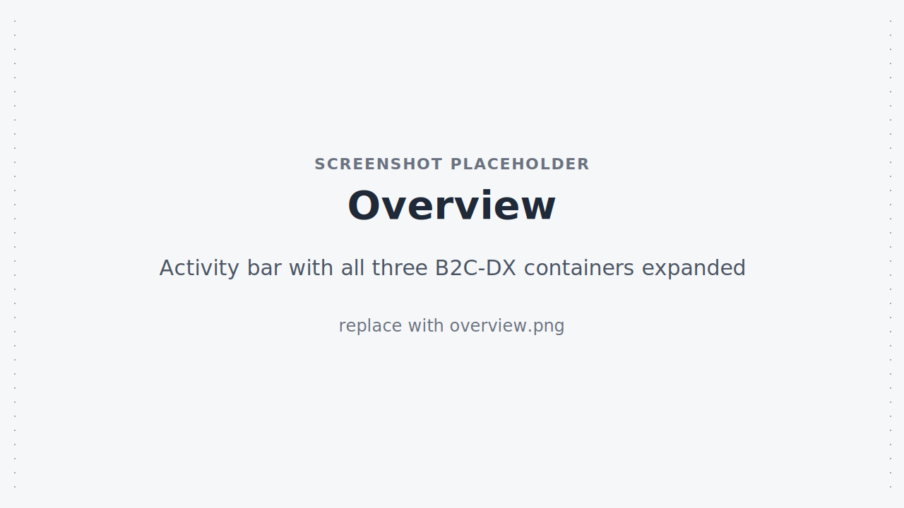

# B2C DX VS Code Extension

::: warning Developer Preview
The B2C DX VS Code Extension is in **active development**. Features may change, break, or be removed without notice. The extension is not yet published to the VS Code Marketplace — install the latest pre-built `.vsix` from GitHub releases (see [Installation](./installation)).

Please file issues and feature requests on the [GitHub repository](https://github.com/SalesforceCommerceCloud/b2c-developer-tooling/issues).
:::

The B2C DX VS Code Extension brings the [B2C CLI](../guide/) and the [B2C Tooling SDK](../api/) into VS Code as a set of dedicated activity-bar containers, tree views, commands, and a debugger. It uses the same `dw.json` / `SFCC_*` environment configuration the CLI uses, so any project that already works with `b2c` works with the extension — no extra setup.

<!-- TODO(screenshot): replace ./images/overview.svg with ./images/overview.png — activity bar with all three B2C-DX containers expanded -->

## Highlights

### Sandbox Realm Explorer

Browse, create, start, stop, restart, clone, and delete on-demand sandboxes (ODS) without leaving VS Code. Cloned sandboxes are tagged in the tree, and the sandbox lifecycle states (`cloning`, `setting up`, `started`, `stopped`, `failed`) drive both the icons and the right-click menu actions you see.

<!-- TODO(screenshot): replace ./images/sandbox-explorer.svg with ./images/sandbox-explorer.png -->

### Cartridge Code Sync

Watch your workspace, deploy cartridges to a sandbox, diff local files against the active code version, and manage code versions (list, create, activate) from a tree view. Per-cartridge upload/download avoids the all-or-nothing sync of older tools.

<!-- TODO(screenshot): replace ./images/code-sync.svg with ./images/code-sync.png -->

### WebDAV & Content Libraries Browser

A first-class file-system view of WebDAV catalogs and libraries (mountable as a workspace folder via the `b2c-webdav://` scheme) plus a content-library tree for Page Designer pages and components, with single-click export (with assets, without assets, or assets only).

<!-- TODO(screenshot): replace ./images/webdav-browser.svg with ./images/webdav-browser.png -->

### B2C Script Debugger

Debug server-side B2C scripts directly from VS Code. Registered as a debug type (`b2c-script`) — add a launch configuration and breakpoint server-side cartridge code as you'd debug any Node project.

<!-- TODO(screenshot): replace ./images/script-debugger.svg with ./images/script-debugger.png -->

### Page Designer Assistant

A guided webview UI for scaffolding Storefront Next page files with PageType and Region definitions — useful when you're starting a new page and don't want to look up the boilerplate.

<!-- TODO(screenshot): replace ./images/page-designer-assistant.svg with ./images/page-designer-assistant.png -->

## Next Steps

- [Installation](./installation) — download and install the `.vsix`.
- [Configuration](./configuration) — feature toggles, log level, polling interval.
- [Features](./features) — full feature tour, including SCAPI API Browser, scaffold, CAP install, log tailing, and B2C CLI plugin support.
