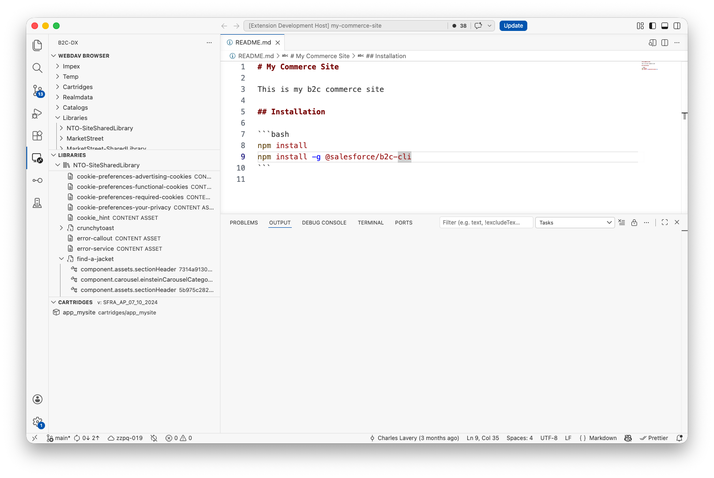
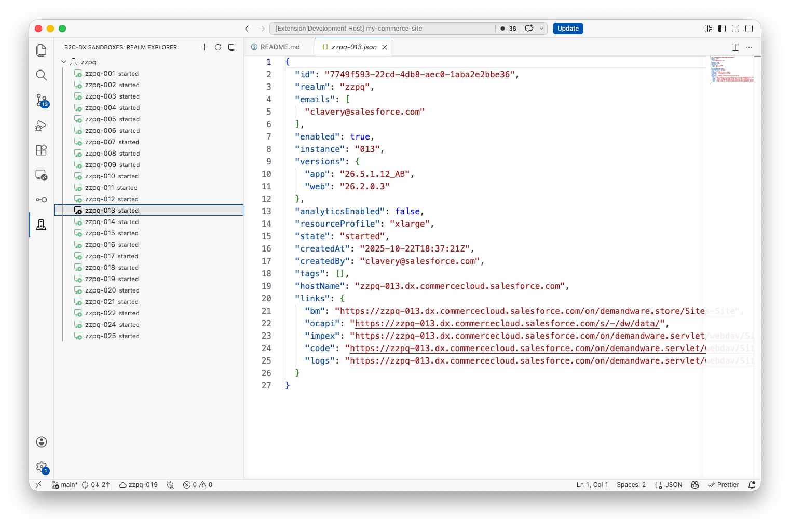
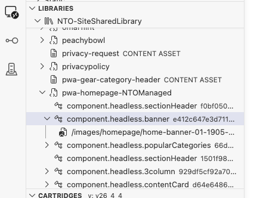

# B2C DX VS Code Extension

::: warning Developer Preview
The B2C DX VS Code Extension is in **active development**. Features may change, break, or be removed without notice. The extension is not yet published to the VS Code Marketplace — install the latest pre-built `.vsix` from GitHub releases (see [Installation](./installation)).

Please file issues and feature requests on the [GitHub repository](https://github.com/SalesforceCommerceCloud/b2c-developer-tooling/issues).
:::

Manage your B2C Commerce sandboxes, sync cartridges, browse content libraries and SCAPI schemas, debug server-side scripts, and scaffold new projects — all from inside VS Code. If your project already works with the [B2C CLI](../guide/), the extension picks up the same connection automatically.

## Highlights

### Sandbox Realm Explorer

Spin up, start, stop, clone, and clean up your on-demand sandboxes from a tree view. Cloned sandboxes are clearly marked, and the right-click menu only shows actions that make sense for the sandbox's current state.

### Library Explorer

Find Page Designer pages and components fast, with one-click export (with assets, without assets, or assets only), live editing of component XML, and round-trip imports of site archives. The library tree is filterable when you have hundreds of pages.

**Content blocks** (reusable, shared `fragment.*` content) get a dedicated **Content Blocks** group under each library — the single source of truth where a block and its full child tree live. Wherever a page or component links a block, it appears as a reference (↗) that reveals the canonical block in the group when clicked, so a shared block is only ever edited in one place. Right-click a component assigned to a page to **Convert to Content Block** and turn it into a reusable, shared block.

### B2C Script Debugger

Step through anything that runs server-side: cartridge controllers, jobs, custom scripts, SCAPI hooks, and Custom APIs. Set breakpoints, drop log points, watch variables, and step in and out — the full debugger experience you'd expect from any other Node project.

On multi-app-server environments, a breakpoint only fires when the triggering request reaches the app server the debugger is attached to. While a debug session is active, run **B2C DX: Copy Debugger Session ID (dwsid)** from the Command Palette to copy the session cookie, then send your triggering request (e.g. in the browser) with `Cookie: dwsid=<value>`. See the [Script Debugger guide](../guide/script-debugger#server-affinity-hitting-breakpoints) for details.

### Cartridge Management and Code Watch/Upload

Edit cartridges locally and have changes show up on your sandbox automatically. Deploy on demand, diff against the active code version, and manage code versions without leaving the editor.

### SCAPI API Explorer

Explore every SCAPI API your instance exposes and try requests against them in a built-in Swagger UI. Authentication is handled for you using the same credentials your CLI already has.

### WebDAV Browser

Browse your sandbox's catalogs, libraries, and IMPEX folders right inside VS Code. Open remote files like local ones, drag-and-drop to upload, or mount a remote folder as a workspace folder.

### Scaffolding

Generate new cartridges, controllers, hooks, jobs, and other boilerplate from a curated set of templates. Available from **File → New File...** or by right-clicking a folder in the Explorer.

### Log Tailing

Stream live `error-*.log`, `warn-*.log`, and `info-*.log` files from your sandbox into a VS Code output channel. Use **Start Tailing Logs** to begin and **Stop Tailing Logs** to end.

### Active Instance Status Bar

The bottom-left of the window shows your active instance — the name, the hostname, and a pin icon if you've locked a particular folder as the project root. Click it to switch instances; every view updates instantly.

### Script API IntelliSense

Cartridge JavaScript files automatically light up with autocomplete and hover docs for `dw/*` modules — no `jsconfig.json` written into your repo. See the [Script API IntelliSense guide](../guide/ide-integration#script-api-intellisense) for how it works and how to enable the same support in other IDEs.

### B2C CLI Plugin Support

The extension runs the [B2C CLI](../guide/) under the hood, so any plugin you've installed via `b2c plugins install` automatically applies here too. Add a plugin that introduces a new config source, a custom sandbox command, or middleware, and the extension picks it up the next time the workspace loads — no separate plugin registry. (The MCP server works the same way; see the [MCP plugins note](../mcp/#plugins).)

## Next Steps

- [Installation](./installation) — download and install the extension.
- [Connecting to your sandbox](./configuration#connecting-to-a-b2c-instance) — what each feature needs.
