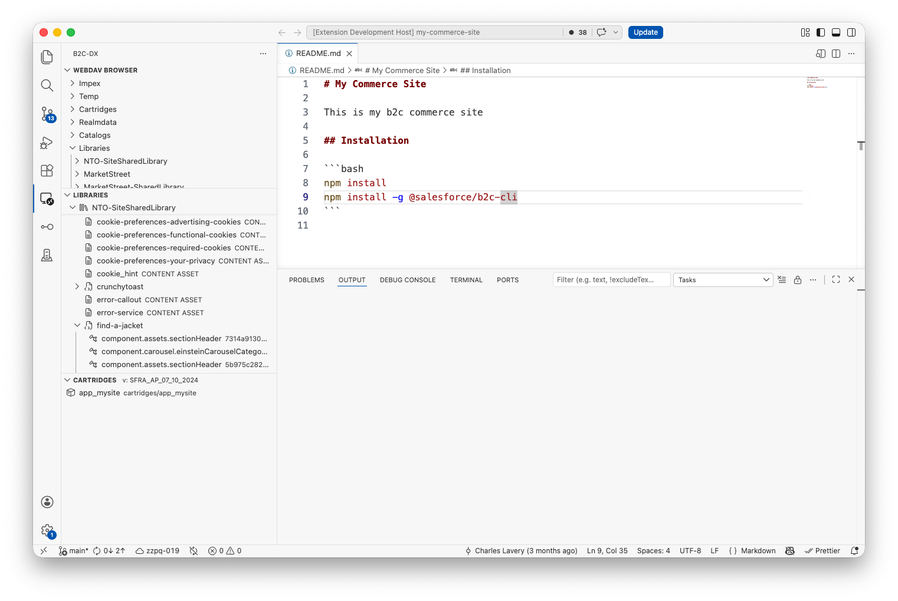
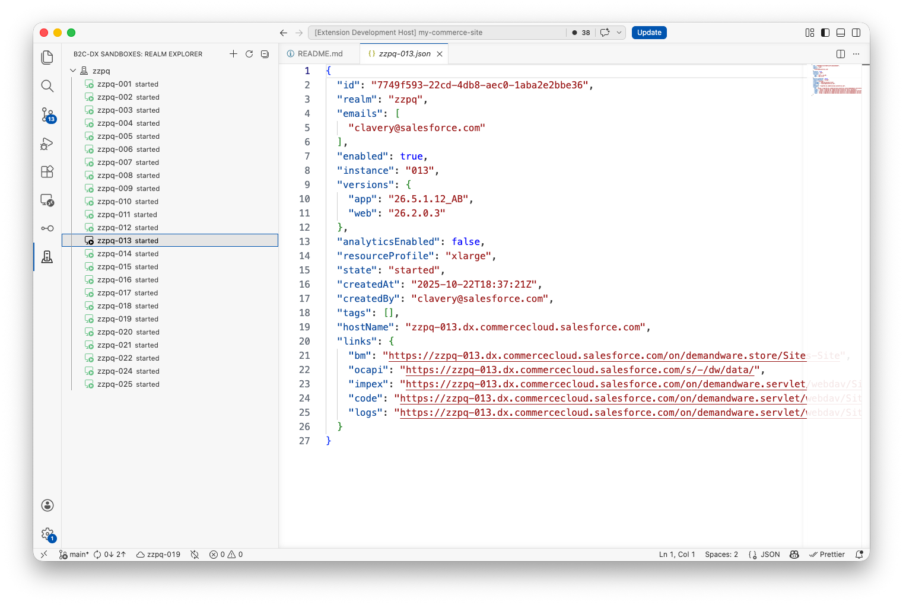
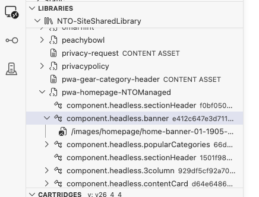

# B2C Commerce IDE Extension

Build and debug B2C Commerce projects in **VS Code, Cursor, and other VS Code-compatible editors** with the official extension published by Salesforce. Manage sandboxes, sync cartridges, browse content libraries and SCAPI schemas, debug server-side scripts, and scaffold new projects from your editor. If your project already works with the [B2C CLI](../cli/overview), the extension picks up the same connection automatically.

Available on the [Visual Studio Marketplace](https://marketplace.visualstudio.com/items?itemName=Salesforce.b2c-vs-extension) and [Open VSX Registry](https://open-vsx.org/extension/salesforce/b2c-vs-extension). See [installation](./installation) for your editor.

## Highlights

### ISML and Script API Editor Support

Write storefront code with ISML syntax highlighting, snippets, formatting, tag completion, diagnostics, and Emmet support. Cartridge JavaScript files automatically provide autocomplete and hover documentation for `dw/*` modules without writing a `jsconfig.json` into your project. See the [Script API IntelliSense guide](../guide/ide-integration#script-api-intellisense) for more detail.

### B2C Script Debugger

Step through anything that runs server-side: cartridge controllers, jobs, custom scripts, SCAPI hooks, and Custom APIs. Set breakpoints, drop log points, watch variables, and step in and out — the full debugger experience you'd expect from any other Node project.

### Scaffolding

Generate new cartridges, controllers, hooks, jobs, and other boilerplate from a curated set of templates. Available from **File → New File...** or by right-clicking a folder in the Explorer.

### Sandbox Realm Explorer

Spin up, start, stop, clone, and clean up your on-demand sandboxes from a tree view. Cloned sandboxes are clearly marked, and the right-click menu only shows actions that make sense for the sandbox's current state. From the Command Palette, **Start/Stop/Restart Sandbox** targets the active status-bar instance (OAuth + ODS sandbox hostname required).

### Library Explorer

Find Page Designer pages and components fast, with one-click export (with assets, without assets, or assets only), live editing of component XML, and round-trip imports of site archives. The library tree is filterable when you have hundreds of pages.

**Content blocks** (reusable, shared `fragment.*` content) get a dedicated **Content Blocks** group under each library — the single source of truth where a block and its full child tree live. Wherever a page or component links a block, it appears as a reference (↗) that reveals the canonical block in the group when clicked, so a shared block is only ever edited in one place. (Converting a component into a content block is done in Business Manager / Page Designer.)

### Cartridge Management and Code Watch/Upload

Edit cartridges locally and have changes show up on your sandbox automatically. Deploy on demand, diff against the active code version, and manage code versions without leaving the editor.

### SCAPI API Explorer

Explore every SCAPI API your instance exposes and try requests against them in a built-in Swagger UI. Authentication is handled for you using the same credentials your CLI already has.

### WebDAV Browser

Browse your sandbox's catalogs, libraries, and IMPEX folders right inside your editor. Open remote files like local ones, drag-and-drop to upload, or mount a remote folder as a workspace folder.

### Log Tailing

Stream live `error-*.log`, `warn-*.log`, and `info-*.log` files from your sandbox into your editor's output panel. Use **Start Tailing Logs** to begin and **Stop Tailing Logs** to end.

### Active Instance Status Bar

The bottom-left of the window shows your active instance — the name, the hostname, and a pin icon if you've locked a particular folder as the project root. Click it to switch instances; every view updates instantly. Palette **Start/Stop/Restart Sandbox** commands use this active instance.

### B2C CLI Plugin Support

The extension runs the [B2C CLI](../cli/overview) under the hood, so any plugin you've installed via `b2c plugins install` automatically applies here too. Add a plugin that introduces a new config source, a custom sandbox command, or middleware, and the extension picks it up the next time the workspace loads — no separate plugin registry. See [CLI extensions](../guide/third-party-plugins) for available integrations.

## Next Steps

- [Installation](./installation) — download and install the extension.
- [Connecting to your sandbox](./configuration#connecting-to-a-b2c-instance) — what each feature needs.
