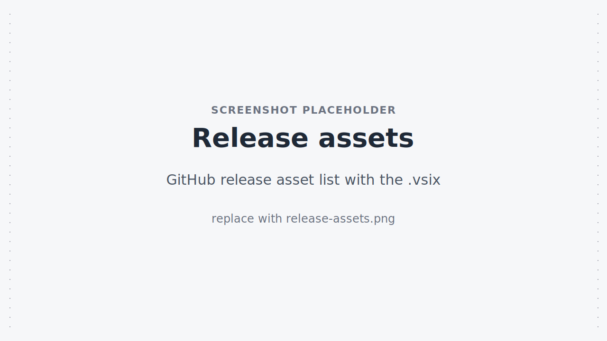
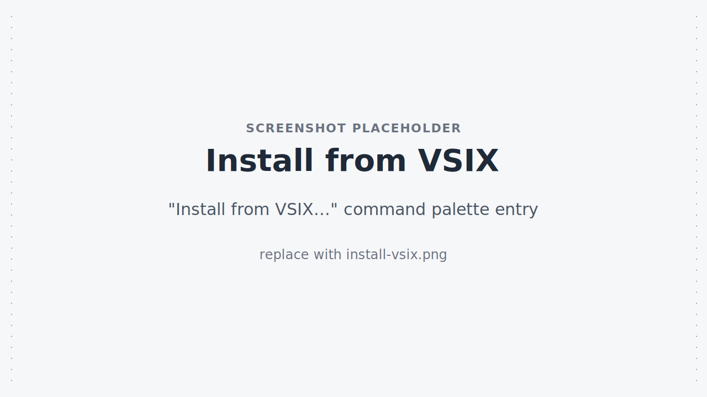

<script setup>
import {data as release} from './release.data.ts';
</script>

# Installation

::: warning Not on the Marketplace
The B2C DX VS Code Extension is **not** published to the VS Code or Open VSX marketplaces yet. Install from the pre-built `.vsix` artifact attached to each GitHub release.
:::

## Download

<div v-if="!release.unavailable">

The latest release is **{{ release.version }}** (published {{ new Date(release.publishedAt).toLocaleDateString(undefined, {dateStyle: 'medium'}) }}).

<p>
  <a :href="release.vsixDownloadUrl" class="vp-button">Download {{ release.vsixAssetName }}</a>
  <a :href="release.releasePageUrl" style="margin-left: 0.75rem">View release notes</a>
</p>

</div>
<div v-else>

No published release was found. Browse the [GitHub releases page]({{ release.fallbackUrl }}) for `b2c-vs-extension@*` tags — releases are filtered by tag prefix.

</div>

<!-- TODO(screenshot): replace ./images/release-assets.svg with ./images/release-assets.png — GitHub release page asset list showing the .vsix -->


## Install from VSIX

After downloading the `.vsix`, install it via the command line or the VS Code UI.

::: code-group

```bash [VS Code (CLI)]
code --install-extension b2c-vs-extension-X.Y.Z.vsix
```

```bash [Cursor (CLI)]
cursor --install-extension b2c-vs-extension-X.Y.Z.vsix
```

```text [VS Code (UI)]
1. Open the Extensions view (Cmd+Shift+X / Ctrl+Shift+X)
2. Click the "..." menu in the view header
3. Choose "Install from VSIX..."
4. Select the downloaded .vsix file
```

:::

<!-- TODO(screenshot): replace ./images/install-vsix.svg with ./images/install-vsix.png — "Install from VSIX..." command palette entry -->


After install, reload the window. The **B2C-DX**, **B2C-DX: SCAPI**, and **B2C-DX Sandboxes** activity-bar containers appear once at least one B2C view is opened or a `commerce-app.json` file is detected in the workspace.

## Prerequisites

- **VS Code** ^1.105.1 (or a compatible Cursor / VS Codium build).
- **B2C CLI** installed and on `PATH` for the workflows that shell out (some scaffold and CAP commands). Install via `npm install -g @salesforce/b2c-cli` — see the [CLI Installation guide](../guide/installation).

## Connect to your instance

The extension reads B2C Commerce credentials from the same sources as the CLI: `dw.json`, `SFCC_*` environment variables, and the active-instance pointer. **Each feature needs different fields** — see [Connecting to a B2C Instance](./configuration#connecting-to-a-b2c-instance) for a per-feature requirements table and an example `dw.json`.

Quick pointers:

- [Authentication Setup](../guide/authentication) — Account Manager API clients, WebDAV access keys, OAuth scopes.
- [CLI Configuration](../guide/configuration) — full `dw.json` field reference and precedence rules.

## Next Steps

- [Configuration](./configuration) — feature toggles, log level, sandbox polling interval.
- [Features](./features) — full feature tour.
