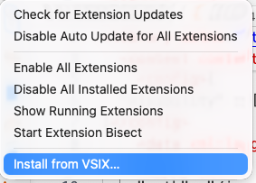

<script setup>
import {data as release} from './release.data.ts';
</script>

# Installation

The **official Salesforce B2C Commerce extension**, published by Salesforce, is available on the Visual Studio Marketplace and the Open VSX Registry.

## Install from your editor

Most of the time you'll install directly from your editor's Extensions view:

1. Open the Extensions view (**Cmd+Shift+X** / **Ctrl+Shift+X**).
2. Search for **Salesforce B2C Commerce**.
3. Pick the extension published by **Salesforce** and click **Install**.
4. Reload the window when prompted.

The extension's developer, operations, API, and sandbox views appear in the activity bar.

Your editor pulls from the right registry automatically:

- **VS Code** installs from the [Visual Studio Marketplace](https://marketplace.visualstudio.com/items?itemName=Salesforce.b2c-vs-extension).
- **Cursor**, **VSCodium**, **Windsurf**, **Eclipse Theia**, and other VS Code–compatible editors install from the [Open VSX Registry](https://open-vsx.org/extension/salesforce/b2c-vs-extension).

Each release is published to both registries at the same time, so they stay in sync.

## Install from the command line

If you prefer the terminal, use your editor's `--install-extension` command:

```bash
# VS Code (Visual Studio Marketplace)
code --install-extension Salesforce.b2c-vs-extension

# Cursor (Open VSX)
cursor --install-extension salesforce.b2c-vs-extension

# VSCodium / Windsurf / other codium-based editors (Open VSX)
codium --install-extension salesforce.b2c-vs-extension
```

## Install from a VSIX

GitHub Releases also provides a pre-built `.vsix` for offline or air-gapped installs where neither registry is reachable.

### Get the latest build

<div v-if="!release.unavailable">

Latest version: **{{ release.version }}** (released {{ new Date(release.publishedAt).toLocaleDateString(undefined, {dateStyle: 'medium'}) }}).

<p>
  <a :href="release.vsixDownloadUrl" class="vp-button">Download {{ release.vsixAssetName }}</a>
  <a :href="release.releasePageUrl" style="margin-left: 0.75rem">See what's new</a>
</p>

</div>
<div v-else>

We couldn't find a published build right now. Head over to the [releases page]({{ release.fallbackUrl }}) and grab the latest `b2c-vs-extension@*` tag.

</div>

### Install it

Once you've got the file, install it from the command line or from the Extensions view in VS Code.

::: code-group

```bash [VS Code]
code --install-extension b2c-vs-extension-X.Y.Z.vsix
```

```bash [Cursor]
cursor --install-extension b2c-vs-extension-X.Y.Z.vsix
```

```text [Extensions view]
1. Open the Extensions view (Cmd+Shift+X / Ctrl+Shift+X)
2. Click the "..." menu in the view header
3. Choose "Install from VSIX..."
4. Pick the file you just downloaded
```

:::

<!-- TODO(screenshot): replace ./images/install-vsix.svg with ./images/install-vsix.png — "Install from VSIX..." command palette entry -->



## Before you start

A few things to have ready:

- **VS Code 1.105 or newer** (Cursor, VSCodium, Windsurf, and other VS Code–compatible editors work too — they install from [Open VSX](#install-from-your-editor)).
- **Access to a B2C Commerce instance** for remote workflows.
- **The B2C CLI is optional.** Install it when you want to run the same operations from the terminal or CI. See the [CLI Installation guide](../guide/installation) for installation options.

## Connect to your sandbox

The extension uses the same connection your CLI already uses, so most of the time there's nothing more to set up. Different features need different credentials though — see [Connecting to your sandbox](./configuration#connecting-to-a-b2c-instance) for what each one needs and a copy-paste example.

New here? The [Authentication Setup guide](../guide/authentication) walks through getting your credentials in the first place.

## Next Steps

- [Overview](./) — what the extension can do.
- [Connecting to your sandbox](./configuration#connecting-to-a-b2c-instance) — what each feature needs.
